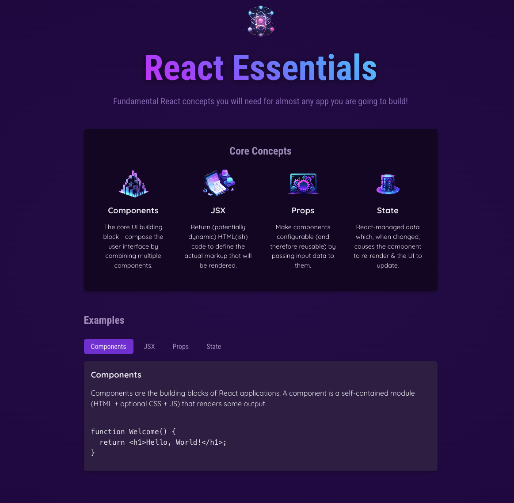

# react-essentials-example-app

## Description
This is a quick and small application based on the React - The Complete Guide 2025 (incl. Next.js, Redux) Udemy course by Maximilian Schwarzmüller. It is as a small demo of fundamental React.js concepts like Components, JSX, Props and State, as well as some basic design patterns.

## Technologies Used

* JavaScript
* HTML
* CSS
* Node.js
* React.js
* Git
* GitHub

## Contact Information

* GitHub Profile: [josevidmal](https://github.com/josevidmal)
* email: josevidmal@gmail.com

## Home Screen

